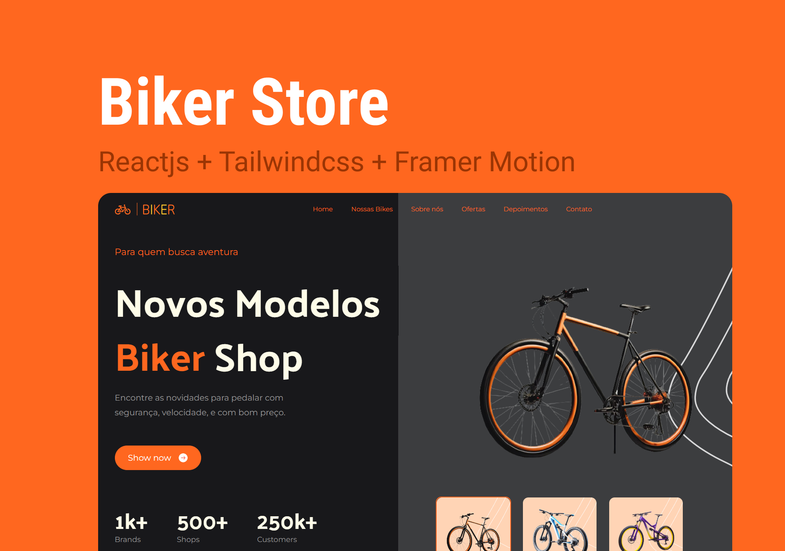

<h1 align=center>🚲 BIKER STORE</h1>

Landing page customizada com Tailwindcss, para exibir loja de venda de bicicletas para todas as modalidades e estilos.

## Demonstração



## React + Vite

This template provides a minimal setup to get React working in Vite with HMR and some ESLint rules.

Currently, two official plugins are available:

- [@vitejs/plugin-react](https://github.com/vitejs/vite-plugin-react/blob/main/packages/plugin-react/README.md) uses [Babel](https://babeljs.io/) for Fast Refresh
- [@vitejs/plugin-react-swc](https://github.com/vitejs/vite-plugin-react-swc) uses [SWC](https://swc.rs/) for Fast Refresh

## Referências

- [Documentação Tailwindcss](https://tailwindcss.com/doc)
- [Aula Tailwindcss - Javascript Mastery](https://www.youtube.com/watch?v=tS7upsfuxmo)
- [Documentação Framer Motion](https://www.framer.com/motion)
- [Figma - Personalização e prototipagem](https://www.figma.com/)

## Features

- Seleção de Bikes do Card (seção Hero)
- Animações com Framer Motion
- Menu Mobile
- Botão Voltar para o Topo
- Scroll personalizado

## Instalação

```bash
# Clonar repo
$ git clone https://github.com/DiegoReports/bike-tailwindcss.git

$ cd bike-tailwindcss

$ npm install
```

## Running the App

```bash
$ npm run dev
```

## Autores

- [@dh.reports](https://www.instagram.com/dh.reports) (Instagram)
